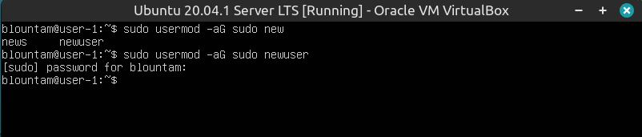
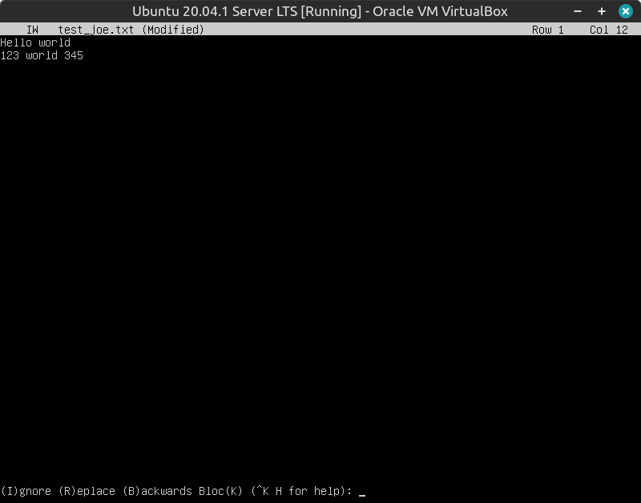
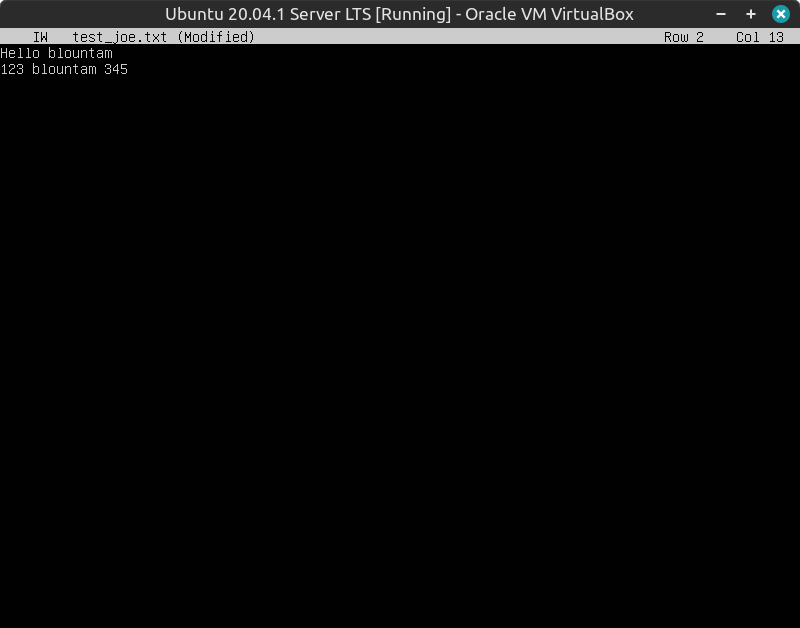
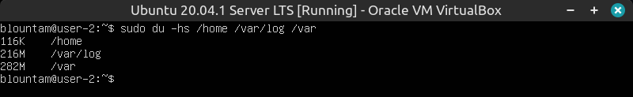

## Contents
1. [Установка ОС](#part-1-установка-ос)  
2. [Создание пользователя](#part-2-создание-пользователя)  
3. [Настройка сети ОС](#part-3-настройка-сети-ос)   
4. [Обновление ОС](#part-4-обновление-ос)  
5. [Использование команды  sudo](#part-5-использование-команды-sudo)  
6. [Установка и настройка службы времени](#part-6-установка-и-настройка-службы-времени)  
7. [Установка и использование текстовых редакторов](#part-7-установка-и-использование-текстовых-редакторов)  
8. [Установка и базовая настройка сервиса SSHD](#part-8-установка-и-базовая-настройка-сервиса-sshd)   
9. [Установка и использование утилит top, htop](#part-9-установка-и-использование-утилит-top-htop)   
10. [Использование утилиты fdisk](#part-10-использование-утилиты-fdisk)   
11. [Использование утилиты df](#part-11-использование-утилиты-df)    
12. [Использование утилиты du](#part-12-использование-утилиты-du)    
13. [Установка и использование утилиты ncdu](#part-13-установка-и-использование-утилиты-ncdu)    
14. [Работа с системными журналами](#part-14-работа-с-системными-журналами)     
15. [Использование планировщика заданий CRON](#part-15-использование-планировщика-заданий-cron)    

## Part 1. Установка ОС

*	**Вывод версии Ubuntu**

При помощи команды ``cat /etc/issue`` получаем версию системы

## Part 2. Создание пользователя

*	**Создание нового пользователя**

При помощи команды ``sudo adduser username`` создаем нового пользователя и добавляем его в группу **adm** командой ``usermod -a -G adm username``

*	**Отображение нового пользователя**

Командой ``grep -e adm /etc/gropup`` выводим список пользователей, находящихся в группе **adm**

## Part 3. Настройка сети ОС

* **Задать название машины вида user-1**

При помощи команды ``sudo vim /etc/hostname`` изменяем в редакторе vim hostname на **user-1**

* **Установить временную зону, соответствующую вашему текущему местоположению**

Командой ``sudo timedatectl set-timezone Europe/Moscow`` меняем временную зону на соответствующую

* **Вывести названия сетевых интерфейсов с помощью консольной команды**

Выполнив команду ``sudo apt install net-tools``, установим утилиту для работы с сетевым окружением.

Команда ``ifconfig`` выведет список сетевых интерфейсов

Виртуальный сетевой интерфейс **loopback** используется для связи компьютера с самим собой. В основном используется для диагностики и устранения неполадок, а также для подключения к серверам, работающим на локальном компьютере. Если сетевой интерфейс отключен — например, когда порт Ethernet отключен, связь через этот интерфейс невозможна, даже связь между вашим компьютером и самим собой. Интерфейс loopback не представляет никакого реального оборудования, но существует, поэтому приложения, работающие на компьютере, всегда могут подключаться к серверам на той же машине. Это важно для устранения неполадок. Его иногда называют диагностическим инструментом.

* **Используя консольную команду получить ip адрес устройства, на котором вы работаете, от DHCP сервера**

Вводим команду ``ip address`` и получаем информацию о том, что ip устройства **10.0.2.15**

Также ip адрес можно увидеть в журнале DHCP, выполнив команду ``cat /var/lib/dhcp/dhclient.leases``

DHCP (Dynamic Host Configuration Protocol) — протокол прикладного уровня модели TCP/IP, служит для назначения IP-адреса клиенту. IP-адрес можно назначать вручную каждому клиенту в локальной сети, но в больших сетях это очень трудозатратно, к тому же, чем больше локальная сеть, тем выше возрастает вероятность ошибки при настройке. Поэтому для автоматизации назначения IP был создан протокол DHCP. 

* **Определить и вывести на экран внешний ip-адрес шлюза (ip) и внутренний IP-адрес шлюза, он же ip-адрес по умолчанию (gw)**

Внутренний ip **10.0.2.2** получаем командой ``route -n``.

Внешний ip можно получить с помощью утилиты **wget**, например командой ``wget -q -O - ifconfig.me/ip``

* **Задать статичные (заданные вручную, а не полученные от DHCP сервера) настройки ip, gw, dns (использовать публичный DNS серверы, например 1.1.1.1 или 8.8.8.8)**

Для этого будем редактировать файл ``00-installer-config.yaml``. Открываем его командой ``sudo nano /etc/netplan/00-installer-config.yaml``

По умолчанию интерфейс «enp0s3» получает IP-адрес от DHCP-сервера. 

Изменяем настройки на статические, после чего содержимое документа выглядит так:

Командами ``sudo netplan apply`` и  ``sudo netplan try`` применяем изменения.

* **Перезагрузить виртуальную машину. Убедиться, что статичные сетевые настройки (ip, gw, dns) соответствуют заданным в предыдущем пункте**

После перезагрузки файл ``00-installer-config.yaml`` сохранил статические настройки.

* **Пропинговать удаленные хосты 1.1.1.1 и ya.ru**

Пингуем хосты после ребута

## Part 4. Обновление ОС

* **Обновить системные пакеты до последней на момент выполнения задания версии**

Нужно по порядку ввести команды:

``sudo apt-get update``

``sudo apt-get upgrade``

``sudo apt-get dist-upgrade`` (выполяет «умное» разрешения конфликтов версий пакетов)

При повторном вводе команды в терминале будет сообщение, что обновления отсутствуют

## Part 5. Использование команды sudo

* Разрешить пользователю, созданному в Part 2, выполнять команду sudo

Использование sudo позволяет выполнять привилегированные команды обычным пользователям без необходимости ввода пароля суперпользователя root.
Добавляем созданного пользователя в группу sudo, чтобы тот мог выполнять команду sudo.
Для этого выполняем команду ``sudo usermod -aG sudo newuser``

* Поменять hostname ОС от имени пользователя, созданного в пункте Part 2 (используя sudo).

Чтобы поменять пользователя, нужно выполнить команду ``su newuser``

Меняем hostname от имени пользователя newuser на user-2

Проверяем изменение

## Part 6. Установка и настройка службы времени

* Вывести время часового пояса, в котором вы сейчас находитесь.

``timedatectl``

Вывод следующей команды должен содержать ``NTPSynchronized=yes:`` 

``timedatectl show``

Cлужба синхронизации времени активна

## Part 7. Установка и использование текстовых редакторов

* **Установить текстовые редакторы VIM (+ любые два по желанию NANO, MCEDIT, JOE и т.д.)**

* **Используя каждый из трех выбранных редакторов, создайте файл test_X.txt, где X -- название редактора, в котором создан файл. Напишите в нём свой никнейм, закройте файл с сохранением изменений**

Для создания файла и редактирование его через VIM пишем ``vim test_VIM.txt``.

Чтобы войти в режим редактирования, нажмем **i**. Чтобы сохранить изменения и выйти из редактора жмем сначала **esc**, затем **:wq**

Вводим команду ``nano test_NANO.txt``, чтобы создать новый документ и редактировать его через редактор **nano**.

Пишем ник и выходим комбинацией **ctr+X**. Подтверждаем сохраниение **Y** и **Enter**.

Устанавливаем редактор **joe** ``sudo apt install joe``.

Создаем новый файл ``joe test_joe.txt``.

Пишем ник и сохраняем файл зажав **ctr** и, последовательно нажав, **K** **X**

* **Используя каждый из трех выбранных редакторов, откройте файл на редактирование, отредактируйте файл, заменив никнейм на строку "21 School 21", закройте файл без сохранения изменений**

Для выхода без сохранения в **VIM** нужно выйти с помощью команды **:q!**

Для выхода без сохранения в **nano** нужно после **ctr+X** нажать **N**.

Для выхода без сохранения в **joe** нужно после **ctr+C** нажать **Y**.

* **Используя каждый из трех выбранных редакторов, отредактируйте файл ещё раз (по аналогии с предыдущим пунктом), а затем освойте функции поиска по содержимому файла (слово) и замены слова на любое другое**

Поиск слова в файле в **VIM** производится через ``/text``.

Поиск и замена шаблона в файле в **VIM** производится командой ``:%s/{patter}/{text}/g``

Поиск слова в файле в **nano** производится через **ctr+W**.

Посик слова/слов производится командой ``ctr+\``

Вводим сначала искомое слово, затем слово для замены и в конце жмем **A**, чтобы изменить все слова на шаблон

Чтобы найти слово в **joe** нужно поставить курсор в начало файла, нажать **ctr+K F**. Будет запрошен образец поиска. После нажатия Enter получим запрос на ввод опций поиска. Нажать Enter еще, чтобы редактор сразу начал поиск.

После указания слова для поиска, можно ввести команду **r**, потом указать шаблон и дальше выбрать **r** для замены по всему тексту

## Part 8. Установка и базовая настройка сервиса SSHD

*	**Установить службу SSHd**

Устанавливаем службу командой ``sudo apt-get install openssh-server``

*	**Добавить автостарт службы при загрузке системы**

Добавляем службу в автостарт ``sudo systemctl enable ssh``

Проверим статус службы, выполнив команду ``sudo systemctl status ssh``

*	**Перенастроить службу SSHd на порт 2022**

Открываем файл конфигурации ``sudo vim /etc/ssh/sshd_config`` и меняем порт с 22 на 2022. Сохраняем, выходим, перегружаем систему.

*	**Используя команду ``ps``, показать наличие процесса sshd. Для этого к команде нужно подобрать ключи**

Используем команду ``ps -FC sshd``, чтобы увидеь процесс

Утилита ``ps`` выводит состояние процессов на экран

  * -F показывает максимально доступные данные процессов
  * -С выбирает процессы по имени команды
  * UID - польтзователь, запустивший процесс
  * PID - инденфикатор процесса
  * PPID - индентификатор родительского процесса
  * C - процент времени CPU, используемое процессом
  * SZ - занимаемое место процесса в памяти
  * RSS - реальный размер процесса в памяти
  * PSR - ядро процессора, на котором выполняется процесс
  * STIME - время запуска процесса
  * TTY - терминал, из которого запущен процесс
  * TIME - общее время процессора, затраченного на выполнение процесса
  * CMD - команда запуска процесса

Проверяем вывод команды ``netstat -tan``

Утилита **netstat** используется для того, чтобы посмотреть работает та или иная сетевая программа, открыты или закрыты порты или просто посмотреть маршрутизацию.

- 0.0.0.0 говорит о том, что к сети нет подключений в данный момент.
- Флаги:
  - -t - подключение по протоколу TCP;
  - -a - отображает подключения;
  - -n - отобразит сетевые адреса в виде чисел.
- Вывод:
  - Proto - протокол, используемый сокетом;
  - Recv-Q - число байтов, не переданных клиентом;
  - Send-Q - число байтов, не подтвержденных удаленным хостом;
  - Local Address - локальный адрес и номер порта локальной сети;
  - Foreign Address - локальный адрес и номер порта удаленной сети;
  - State - состояние сокета.

## Part 9. Установка и использование утилит top, htop

* **Установить и запустить утилиты top и htop.**

* **Утилита ``top``**

  *	uptime - ``up 1 min``;
  *	количество авторизованных пользователей - ``1 user``;
  *	общая загрузка системы. Указано 3 параметра - за 1 мин, 5 мин, 15 мин соответствнно. Все 0.00;
  * общее количество процессов -  ``Tasks 102 total``.  Их классифицируют на работающие, спящие, остановленные и зомби (выключенные и не очищенные);
  * загрузка cpu ``%Cpu(s):`` система простаивает, поэтому около нуля;
  * загрузка памяти ``MiB Mem :`` - загрузка оперативной памяти - 3924.3. ``MiB Swap:`` - загрузка файла подкачки - 0;
  * PID процесса, занимающего больше всего памяти. Комбинацией ``shift+M`` сортируем таблицу по занимаемой памяти. Это процесс с PID 408

	
  * PID процесса, занимающего больше всего процессорного времени. Изначально таблица отсортирована так, что сортирует процессы по процессорному времени.

	

  * **Утилита ``htop``**

  * Чтобы отсортировать, жмем ``F6`` и выбираем параметр сортировки
		
	PID

    	
			
	PERCENT_CPU

     

	PERCENT_MEM

    

	TIME

     

  *	отфильтрованному для процесса sshd. Жмем ``F4`` и вводим sshd;

	

  *	с процессом syslog, найденным, используя поиск. Жмем ``F3`` и вводим syslog;

	

  *	с добавленным выводом hostname, clock и uptime.  Жмем ``F2`` и в правой колонке выбираем нужные параметры, после чего жмем ``F10``

	

## Part 10. Использование утилиты fdisk

* **Выполняем команду ``sudo fdisk -l``**

  - название жесткого диска ``/dev/sda``;
  - размер жесткого диска ``10 GIB``;
  - количество секторов ``20971520``;
  - размер swap. По результатам работы утилиты ``top`` было видно, что swap равен 0.

## Part 11. Использование утилиты df

*	**Запускаем команду ``df``**

  - размер раздела ``8408452 kB``
  - размер занятого пространства ``2719320 kB``
  - размер свободного пространства ``5240416 kB``
  - процент использования ``35%``
  - 1K-blocks = 1 kB

* **Выполняем команду ``df -Th``**

  - размер раздела ``8.1 G``
  - размер занятого пространства ``2.6 G``
  - размер свободного пространства ``5.0 G``
  - процент использования ``35%``
  - тип файловой системы раздела ``ext4``

## Part 12. Использование утилиты du

* **Запустить команду ``du``**

* **Вывести размер папок /home, /var, /var/log (в байтах, в человекочитаемом виде)**

Выполним команду ``sudo du -hs /home /var/log /var``
  * Флаг -h выводит информацию в человекочитаемом виде
  * Флаг -s выводит только корневую папку с общим размером всех вложенных файлов и папок

* **Вывести размер всего содержимого в /var/log (не общее, а каждого вложенного элемента, используя** ***)**

Выполним команду ``sudo du -h /var/log*``

## Part 13. Установка и использование утилиты ncdu

* **Установить утилиту ncdu**

Выполняем команду ``sudo apt install ncdu``

* **Вывести размер папок /home, /var, /var/log**

Выполняем команду ``ncdu /`` и проходимся по нужным разделам, чтобы получить информацию о размерах разделов

  * /home 96 KiB

	

  * /var 493.7 MiB

	

  * /var/log 215.6 MiB

	

## Part 14. Работа с системными журналами

* **Открываем системные журналы**

Будем делать это при помощи утилиты ``tail``, которая по умолчанию показывает последний 10 строк файла

  * ``tail /var/log/dmesg``

	

  * ``tail /var/log/syslog``

	

  * ``tail /var/log/auth.log``

	

Строчка в журнале ``auth.log`` с последней успешной авторизацией

Перезапускаем службу **SSHd** командой ``sudo systemctl restart ssh.service``. В журнале syslog видим информацию об успешном рестарте службы

## Part 15. Использование планировщика заданий CRON

* **Используя планировщик заданий, запустите команду uptime через каждые 2 минуты**

Выполняем команду ``crontab -e`` и выбираем редактор. Внизу файла вводим команду ``*/2 * * * * uptime``

Убедимся, что каждые 2 минуты планировщик вызывает uptime, войдя в системный журнал

Теперь удалим задачи планировщика и выведем их список, поочередно выполнив команды

  * ``crontab -r``
  * ``crontab -l``

